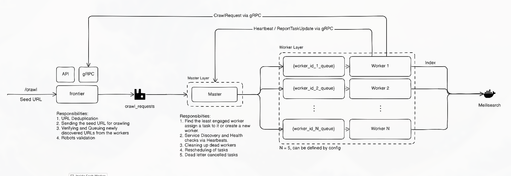
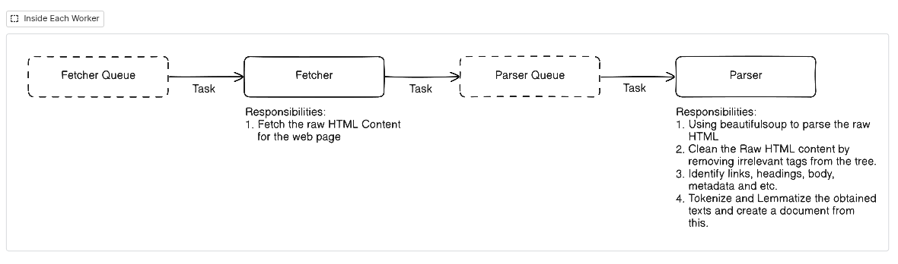
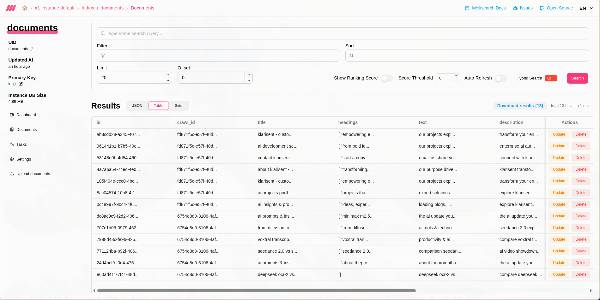

# Distributed Web Crawler

A highly scalable, distributed web crawler built with Python 3.13+ utilizing an event-driven architecture. The system is designed to handle mass-scale web scraping tasks by dynamically scheduling and distributing workloads across auto-scaling worker nodes. 

## 🏗 Architecture & Core Components

This project is decoupled into three primary microservices:

### Platform Architecture

*High-level overview of the Frontier, Master, and Infrastructure services interacting to enqueue and allocate crawl tasks.*

### Worker Auto-Scaling Architecture

*Detailed look at how the Master Node dynamically provisions Docker containers for individual Master-Worker scraping tasks.*

### 1. Frontier Service 
**Role:** API Gateway & State Management

The Frontier Service acts as the public-facing entry point and the "brain" for state management. When a client submits a new URL to be crawled, the Frontier verifies the URL, writes initial tracking data to the state database, and places the core parameters into the message broker. 
- **REST API:** Exposes a FastAPI interface on port `8080` for users to submit, manage, and monitor crawl requests.
- **Queueing Engine:** Dispatches prioritized crawl jobs into RabbitMQ message queues for the Master node to pick up.
- **State Management:** Coordinates with PostgreSQL (via SQLModel) to track crawl metadata, progress metrics, and error logs, alongside Redis to perform high-speed URL deduplication and stop circular scraping.
- **gRPC Server:** Features a robust gRPC endpoint that processes inbound structured data payloads sent from crawler workers seamlessly over HTTP/2, acting as the sink for all scraped data.

### 2. Master Service (Orchestrator)
**Role:** Workload Manager & Node Orchestrator

The Master Service is the control plane for the distributed workers. It abstracts the scaling and scheduling complexity away from the rest of the application. It acts as a continuous consumer of the task queues provided by Frontier.
- **Task Distribution:** Continuously consumes messages from RabbitMQ containing pending crawl requests and allocates them.
- **Dynamic Auto-Scaling:** Utilizes the Docker Socket API directly to automatically provision, spin up, assign identities, and tear down temporary `Worker` containers based precisely on the volume of the current workload. 
- **Data Indexing & Sink Integration:** Acts as a broker for finalized data, transmitting parsed DOM objects to Meilisearch to enable high-speed indexing and full-text querying on scraped textual content.

### 3. Worker Service (Slave)
**Role:** Execution Node

The Worker Service represents a single, highly decoupled scraping agent. These nodes are inherently short-lived processes spawned on-demand by the Master Service.
- **Scraping Engine:** A dynamically spawned container loaded with Python scraping tools that retrieves allocated URLs, processes pages, handles dynamic javascript execution if necessary, and extracts pertinent data objects (e.g. titles, bodies, and hyperlinks).
- **Reporting Mechanism:** Compiles the parsed structural data and streams it back to the Master/Frontier services via high-performance, low-latency gRPC streams for storage and indexing, while immediately freeing resources.

## 🛠 Tech Stack & Infrastructure

- **Language:** Python 3.13+
- **Environment Management:** [uv](https://github.com/astral-sh/uv) (Extremely fast Python package manager)
- **RPC Framework:** gRPC / Protobufs
- **Message Broker:** RabbitMQ
- **Relational Database:** PostgreSQL (Models managed via SQLModel & AsyncPG)
- **Caching & Deduplication:** Redis
- **Search Engine:** Meilisearch (For full-text querying on scraped data)
- **Containerization:** Docker & Docker Compose

## 🚀 Getting Started

### Prerequisites
- Docker & Docker Compose
- Python 3.13+ installed locally (for local development)
- [uv](https://github.com/astral-sh/uv) package manager installed

### Installation & Setup

1. **Clone the repository**
   ```bash
   git clone <repository-url>
   cd web-crawler
   ```

2. **Start Infrastructure & Databases**
   Bring up the peripheral services (Postgres, RabbitMQ, Redis, Meilisearch, and their respective admin UIs):
   ```bash
   docker compose up -d postgres rabbitmq redis meilisearch pgadmin redisinsight meilisearch-admin
   ```

3. **Run the Application Platform**
   Start the core crawler services (Frontier, Master). Note that Workers are auto-provisioned by the Master node when tasks arrive.
   ```bash
   docker compose up -d frontier master
   ```

*To run locally for development without Dockerizing the Python apps, use `uv sync` to install dependencies from the workspace, and run `uv run --package <package-name> ...` tailored to each service.*

## 👁️ Observability & Admin Interfaces

When running locally via Docker Compose, you can access the following management UIs:
- **FastAPI Docs (Frontier):** [http://localhost:8080/docs](http://localhost:8080/docs)
- **Meilisearch Admin:** [http://localhost:7701](http://localhost:7701) (View indexed scraped data)
- **RabbitMQ Management:** [http://localhost:15672](http://localhost:15672) (Credentials: `admin` / `password`)
- **PgAdmin:** [http://localhost:5050](http://localhost:5050) (Credentials: `admin@example.com` / `admin`)
- **RedisInsight:** [http://localhost:8001](http://localhost:8001)

### Indexed Search Data (Meilisearch)

*A view from the local Meilisearch Admin UI showing successfully parsed and indexed text data from a scraping worker.*

## 📝 API Usage Example

**Submit a new Crawl Job**
```http
POST http://localhost:8080/crawl
Content-Type: application/json

{
  "url": "https://example.com",
  "depth": 2,
  "max_pages": 100
}
```

## 🤝 Project Structure
Built utilizing a `uv` workspace structure containing `shared` monolithic dependencies among independent loosely-coupled microservices located inside `services/`.
